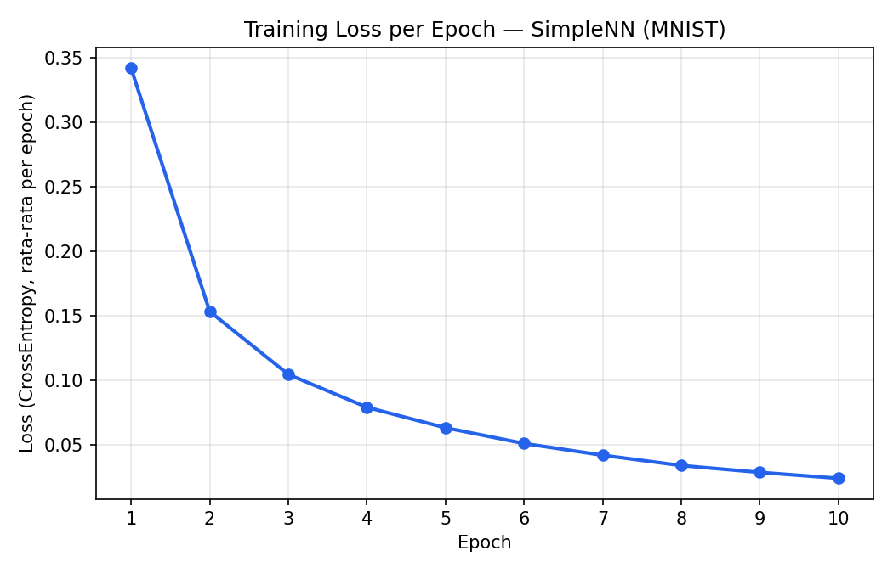
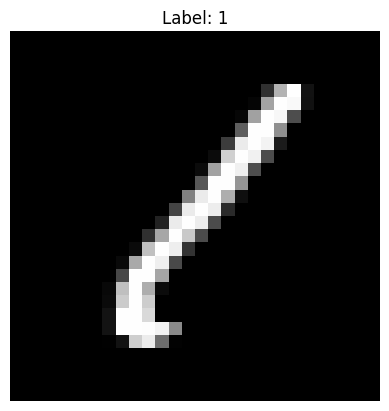
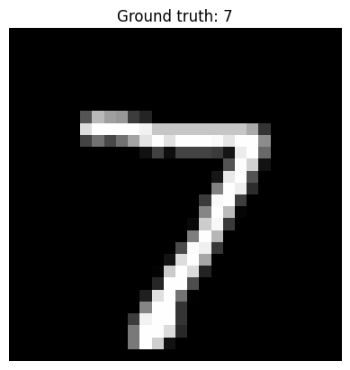

# MNIST Digit Classifier — PyTorch (SimpleNN)

Latihan dasar Deep Learning dengan PyTorch: membangun, melatih, dan mengevaluasi neural network sederhana untuk klasifikasi angka tulisan tangan (dataset MNIST).

**Bootcamp:** rubythalib.ai AI Engineer Bootcamp
**Mentor:** Daniel Syahputra
**Author:** Muhammad Ariel Shakaramiro

---

## Ringkasan Proyek

Notebook ini mencakup workflow Deep Learning end-to-end dengan PyTorch:

1. Load dataset & DataLoader (MNIST, 60.000 train / 10.000 test)
2. Eksplorasi & visualisasi data
3. Membangun model `SimpleNN` (fully-connected neural network)
4. Menentukan loss function & optimizer
5. Training loop (10 epoch)
6. Evaluasi akurasi di data test
7. Inference pada satu gambar
8. Save & reload model (`state_dict` dan full model)

## Arsitektur Model

```
SimpleNN(
  (fc): Sequential(
    (0): Flatten(start_dim=1, end_dim=-1)
    (1): Linear(in_features=784, out_features=128, bias=True)
    (2): ReLU()
    (3): Linear(in_features=128, out_features=10, bias=True)
  )
)
```

- Loss function: `CrossEntropyLoss`
- Optimizer: `Adam` (lr=0.001)
- Seed: `torch.manual_seed(42)` — untuk reproducibility

## Hasil Terverifikasi

Hasil di bawah ini diambil dari run resmi di Google Colab (GPU), notebook dijalankan penuh dari awal (Run All) tanpa error.

| Epoch | Loss |
|---|---|
| 1 | 0.3421 |
| 2 | 0.1532 |
| 3 | 0.1044 |
| 4 | 0.0789 |
| 5 | 0.0630 |
| 6 | 0.0508 |
| 7 | 0.0417 |
| 8 | 0.0337 |
| 9 | 0.0284 |
| 10 | 0.0238 |

**Akurasi di data test: 97.86%**



## Dokumentasi Gambar & Hasil

### Contoh Data (MNIST)

Salah satu sampel dari batch training — gambar tulisan tangan berlabel `1`:



### Hasil Inference

Model diuji pada gambar pertama dari data test (`test_dataset[0]`):



| | Nilai |
|---|---|
| Ground truth | 7 |
| Prediksi model | 7 |
| Status | ✅ Benar |

## Cara Menjalankan

1. Buka `deep-learning-pytorch-mnist-verified.ipynb` di Google Colab (atau lokal dengan environment yang punya akses internet untuk download dataset MNIST).
2. Jalankan seluruh sel secara berurutan (**Run All**).
3. Dataset MNIST akan otomatis ter-download via `torchvision.datasets.MNIST(download=True)`.
4. Model akan tersimpan sebagai `model_mnist.pth` (bobot) dan `full_model_mnist.pth` (seluruh model) di direktori kerja.

## Struktur Repo

```
.
├── deep-learning-pytorch-mnist-verified.ipynb   # Notebook utama
├── assets/
│   ├── training-loss.png                        # Grafik loss training
│   ├── sample-data-preview.png                   # Contoh data MNIST
│   └── inference-example.png                     # Hasil inference (ground truth vs prediksi)
├── README.md
└── .gitignore
```

> Catatan: file bobot model (`*.pth`) dan folder `data/` sengaja tidak diikutsertakan di repo ini (lihat `.gitignore`) karena ukurannya besar dan bisa di-generate ulang dengan menjalankan notebook.

## Latihan Lanjutan

Beberapa ide eksplorasi lanjutan dari notebook ini:

- Ubah ukuran hidden layer (128 → 256 atau 64) dan amati pengaruhnya ke akurasi.
- Tambahkan layer fully-connected baru.
- Ganti optimizer dari Adam ke SGD.
- Tambahkan `Dropout` untuk mencegah overfitting.

---

*Bagian dari seri catatan belajar AI Engineering — [AI Notes & Engineering](https://shaka-ai.hashnode.dev)*
